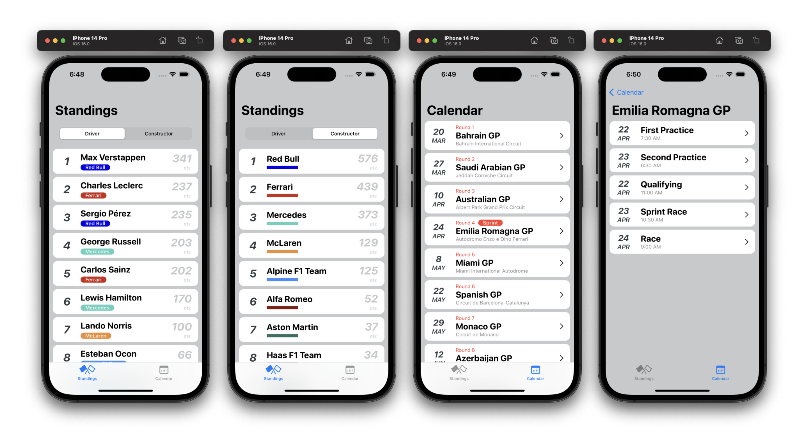
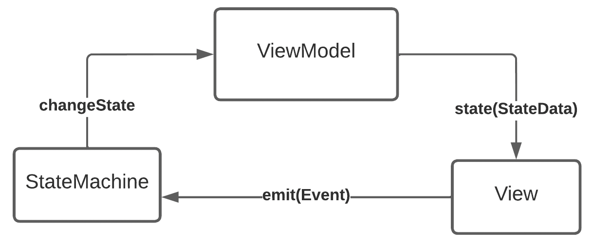

# BoxBox Formula 1 app

This app contains the current driver and constructor championship standins as well as a schedule with information related to each grand prix.

The app is pulling data from the [Ergast Public Developper API](http://ergast.com/mrd/terms/)

## Screenshots



## Architecture

### Dependency Injection

The app have a basic dependency injection layer based on the factory design pattern for the creations of views.
Each view is instanciated with it's id like so :
```swift
viewFactory.makeView(id: .standing)
```

The view factory is in charge of returning the associated view. The methods for creating the views are being injected to the view factory following the `ViewFactoryAssembly` protocol. Each method is responsible for creating the view and everything else needed for the view to be operatable such as its `ViewModel`, and the source of data.

The advantage of this approach decopoules completely the view from the logic associated to create the next view that will be pushed to the stack and make it really easy to switched the source of data. Having the app run with mocked data instead of pocking the api is as easy as changing the assemblie enum from `ViewFactory.Factory(assembly: Assemblies.forRuntime)` to `ViewFactory.Factory(assembly: Assemblies.forPreview)`.
It is also really usefull for preview content.

### Data flow

Each view has its own `ViewModel` and is listenning to the `@Published state` value. The views are built from a `@ViewBuilder makeView(basedOn: state)` method where the state gets pushed to the view with the content to be displayed every time there is a new change.


